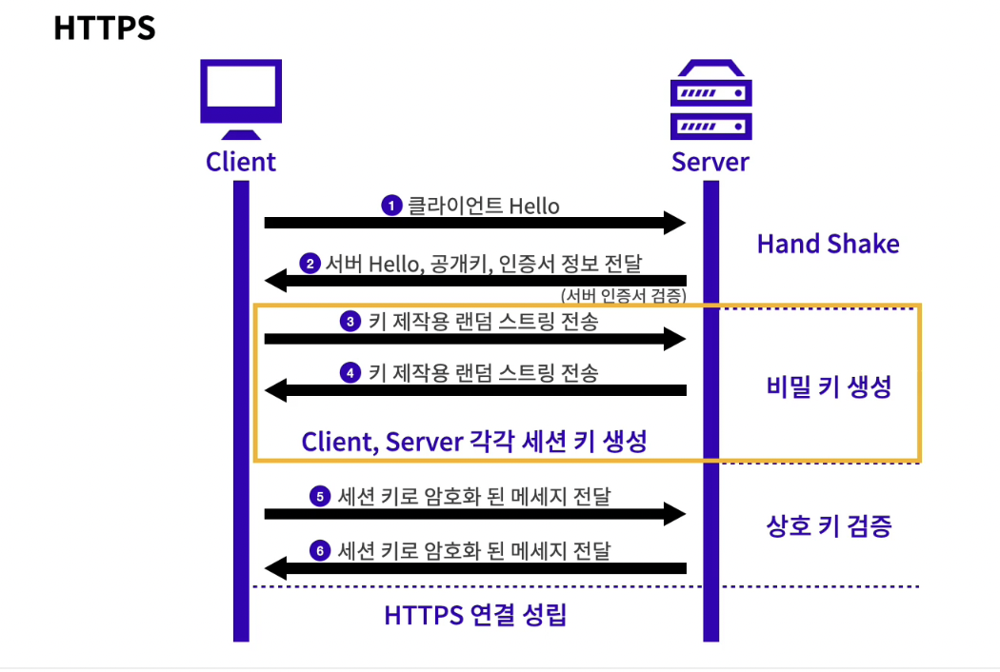

# **https란?**


---

## 1. https란?

- https (hyper text transfer protocol + security)

- 기존 http는 내가 보내는 요청이 그대로 노출이 되기 때문에 제 3자가 그 요청을 보고 정보를 뺴돌릴 수 있었다.
- 하지만 https는 내가 보내는 요청이 암호화된 텍스트 형태로 전송이 되기 떄문에 안전.

- 또한 외부 사이트에서 보내오는 정보가 실제로 그 장소에서 오는 정보인지 확인할 수 있음.

- https는 공인된 사이트에만 사용이 가능하고, http를 사용하는 사이트에 접근시에 안전하지 않다는 워닝이 뜸 -또한 공개키, 비밀키라고 하는 시스템을 이용하여 정보를 암호화, 복호화함
- 용어중에 대칭키라는 용어와 비대칭키라는 용어가 있는데, 대칭키는 말 그대로 각 컴퓨터가 동일한 키를 가지고 그것을 가지고 암호화 복호화를 한다는 소리고, 비대칭키는 그것 + 한쪽만 가지고 있는 키와 같이 서로 다른 키가 있는 것을 뜻함.
- 이렇게 설정해야 하는 이유는, 아무리 대칭키 시스템이 좋다고 해도 한번은 한 컴퓨터에 대칭키를 전달해줘야 하는 순간이 있는데 이 순간 그것을 탈취당한다면 대칭키 시스템은 무용지물임
- 따라서 1970년대 수학자들이 이 문제를 해결하기 위해 내놓은 것이 비대칭키 시스템이고 이게 바로 비밀키와 공개키 시스템임
- 예를들어, 서버에서 a라는 비밀키와 b라는 공개키가 있을 때, b로 암호화한 정보는 b로 해독하는 게 아닌 비밀로 가지고 있는 a키로만 해독할 수 있는 방식.
- 근데, 공개키는 말 그대로 전 세계에 뿌려지는 공개되는 키라서 이 공개키가 진짜 내가 타겟으로 정한 'foo' 서버의 공개키인건지 아닌건지를 확인할 수 있어야 함. (만약 내가 가지고 있는 공개키가 사실 해커의 공개키였다면 그거가지고 암호화해서 보내버리면 해커는 그 정보를 지가 갖고있는 개인키로 풀어서 확인해버릴 수 있을거임)
- 따라서 이 문제를 해결하기 위해 해당 공개키가 'foo'의 공개키를 확인할 수 있는 작업이 필요함. 이게 바로 CA에서 하는 역할임
- 예를들면, 서버에서 공개키를 보낼 때에 그냥 그것만 보내는건 위험하니 CA 즉 인증서 시스템을 이용하여 _공개키, 보낸쪽의 서버이름, 인증서의 종류와 유효기간, 기타 인증서의 모든 정보가 해시화된 값, 그리고 가장 중요한 인증서의 내용 전체를 종합적으로 해시화한 암호값_ 을 전송함.

---

## 2. 암호화와 복호화 과정



- 처음 클라이언트와 서버는 handshake라는 과정을 거쳐 서로에 대해서 인식한다(클라이언트가 랜덤으로 아무것이나 전송하면 서버가 역시나 무작위의 데이터와 함께 해당 서버의 인증서를 전송한다.)

```
**여기서 잠깐**

클라이언트가 서버에게 요청을 보내기 전, 클라이언트 입장에선 서버가 진짜 서버인지 확인할 방안이 필요하다. 이것을 하는 방법이 바로 서버측에서 애초에 유저가 handShake 과정에서 랜덤하게 보낸 데이터를 받아보고 단순한 랜덤데이터와 함께 인증서로 공개키와 기타 정보들을 담아 보낼 때,

이 인증서, 즉 정보를 담은 패키지를 열어볼 수 있는가 없는가를 확인한다.

이 인증서는 공인된 rootCA 회사의 비공개 키로 암호화된 시스템으로, 모든 브라우저는 공인된 CA에 대한 비밀키가 존재한다.

만약 중간에 누가 이 인증서를 탈취 후, 자신도 CA의 공개키를 이용해 풀어가지고 악의적인 인증서를 따로 만들어서 내용물을 첨부한다고 치자.

유저에게 전송이 되면 유저는 자신역시 브라우저에 전송되어 있는 CA를 통해서 해당 인증서를 열어볼려고 할 것이다. 될리가 없다

이런 경우 누군가에게 탈취되었다는 것을 알 수 있으므로 요청을 실패시킬것이며

인증서의 내용물에는 위에서 말했듯, 요청을 보낸 서버정보, 인증서 정보, 해시뢰 묶인 전체정보 등이 담겨있다. 만약 보낸 사람이 서버가 아니라면 내용물이 변조되었다는 소리이므로 이것도 아웃이다.
```

- 클라이언트는 해당 받아온 정보에서 인증서 부분의 검증을 한다(위에서 말했듯, 정보는 인증서로 감싸져서 오고있고 이 인증서가 신뢰할 수 있는 기관에서 쌓여서 온 것인지 확인하는 것을 각 브라우저에 내장되어 있는 신뢰할 수 있는 CA의 공개키로 해당 인증서가 해독이 되는지 안되는지로 판별한다.)
- 브라우저는 CA의 공개키를 가지고 해당 CA가 날짜가 유효한지, 접속하려는 사이트와 관련되있는지 등을 확인한다.
- 그 후, 받았던 인증서에 포함되어있는 공개키 정보를 이용하여 보내려는 메세지를 건내받은 서버의 공개키로 암호화하고, 서버에 보낸다
- 이 공개키로 암호화한 내용은 서버의 비밀키로만 열리므로, 제 3자가 탈취한다고 한들 서버의 비밀키가 없으면 열어볼 수가 없으니 괜찮다.
