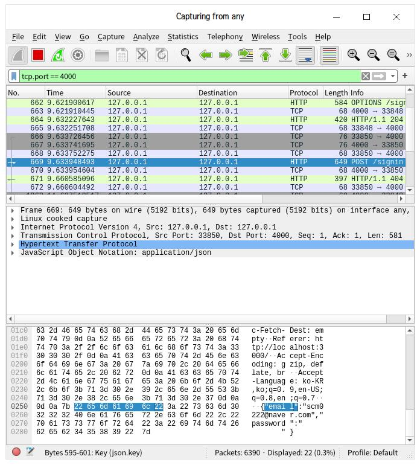
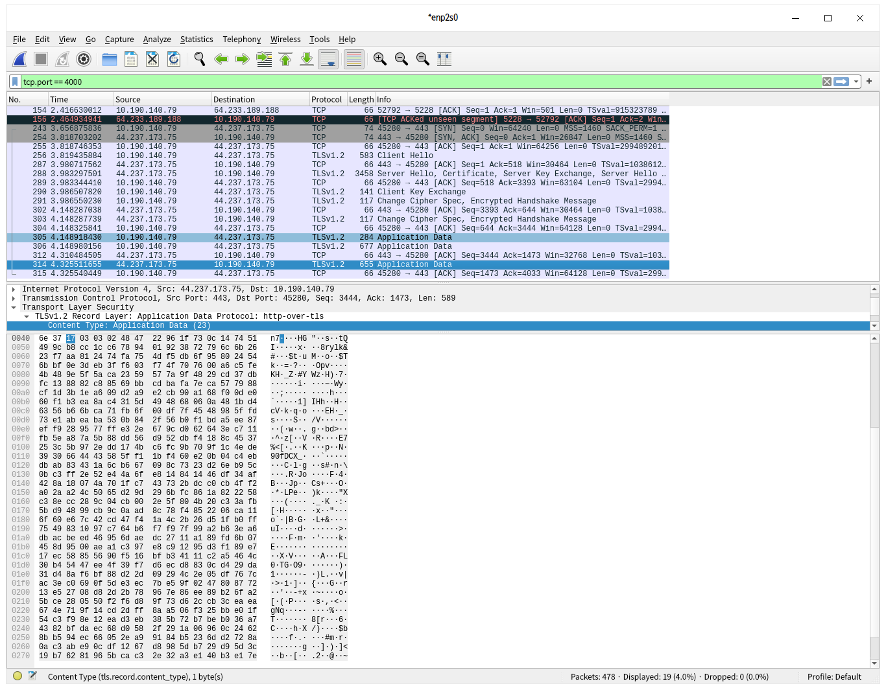

# **네트워크에 대한 기본적인 내용들을 정리한다**

---

## 1. http와 https 의 관계

http는 네트워크를 통해 서버와 클라이언트가 소통하기 위한 통신 규악, 즉 프로토콜을 칭한다. 이 http의 기본 형태인 request와 서버로부터의 응답인 response 객체의 교환과정을 통해 정보를 쉐어링하는데, 이 구조의 가장 큰 문제는 중간자 공격에 탈취당하기가 아주 쉽다는 점이다

(네트워크 전송의 패킷을 분석하는 Wireshark의 모습)

해당 프로그램을 통해 살펴볼 수 있는 것은 http 형태의 요청이 패킷 형태로 전달될 때에 이것을 그냥 중간에서 탈취하면 아주 쉽게 뭘 보내고 있는지를 확인이 가능하다는 점이다.

그러면 패킷이 무엇을 의미하는가

패킷이란 네트워크의 출발지와 목적지 간 사이에서 데이터가 전송되기 위해 분할압축처럼 효과적으로 나누어지는 구조를 뜻한다. 예를 들어, 유저로부터 서버에게 이메일주소와 비밀번호가 전송이 될 경우, 이것을 데이터 그대로 보내기에는 크기가 너무 크다. 그래서 그것을 분할하여 패킷으로 감싸서 보낸다

패킷은 크게 사용자데이터와 제어정보로 이루어진다.
사용자데이터는 페이로드라고하며, 제어정보는 이 페이로드를 전달하는 데에 쓰이는 정보다.
예를들어 제어정보에는 각 패킷의 소스가 어디인지, 그리고 어디로 가야하는지, 서로를 구분하기 위한 ID는 무엇인지 등의 정보가 담겨있다. 조금 더 자세하게 설명하자면

1. 헤더 : 소스의 주소, 가야되는 대상의 ip주소, 프로토콜, 및 패킷의 식별 번호가 저장된다
   (패킷의 식별번호는 전해지는 데이터가 얼마만큼 쪼개졌는지에 대한 정보와 같은 것이 들어있다.)

2. 페이로드 : 패킷에 의해 전송되야 하는 쪼개져 있는 데이터(바이트단위로 되어있다) 데이터의 쪼가리다.

3. 트레일러 : 수신대상에게 데이터가 제대로 도착했는지 안했는지를 확인시켜주는 알림 기능이 들어있다.

하지만 이정도로 끝나지 않는다. 패킷은 유저에서 방대한 디지몬 세계인 네트워크 환경으로 전송하기 위한 포장단위가 한번
더 있는데 이것을 세그먼트라고 한다.

여튼, 결국 중요한 것은 우리가 물리적으로 연결한 네트워크 선을 통해서 전달되는 데이터는 라우터를 통해 어느 네트워크 길을 가는것이 가장 효율적인지를 확인한 후, 이 데이터를 쪼개서 패킷으로 만든다. 패킷의 헤더에는 어디로가야할지, 어디서 왔는지, 어떤 프로토콜을 써야 제일 효율적으로 전송되는건지, 그리고 얼마나 쪼개져있는지 등에 대한 정보가 담겨있고, 페이로드를 통해 실제 데이터의 조각을 담아서 보내며, 이 조각이 잘 전달됬는지 아니면 다 아까 말했던 식별번호에 저장된 총 개수에 맞게 다 전송되서 거기서 합쳐지는거까지 됬는지 확인해주는 트레일러를 담아서 넘겨진다.

그리고 나서 네트워크 세계로 넘어가기 전에 세그먼트로 다시 감싸서 압축 후 보내는데,

가끔 네트워크 패킷이 손실되었다는 문구를 보게 될 때가 있다. 이것은 네트워크가 너무 혼잡해서 패킷들이 전부 다 전송되지 못하거나 너무 느려저서 결국 네트워크가 자체적으로 폐기할 때에 일어난다. 요 근래에는 버킷이라는 시스템을 이용하여 서로간에 얼마만큼을 전송할 수 있는지에 대한 데이터를 미리 받은 후, 그만큼만을 전송하고 서버입장에서 윈도우라는 개념을 써서 어느정도 공간이 비었으면 더 보내! 하고 호출을 하여 서로 상호작용을 통해 전송을 하는 방식을 이용하고 있다.

---

말이 길어졌는데, 여튼 패킷으로 쪼개져서 보낼때에 그 패킷에는 어떤 프로토콜을 이용해야 한다는 정보가 담겨있다. 즉, 이 프로토콜에 따라서 보내지는 형태가 달라지는데, 만약 http 프로토콜을 사용한다면 그냥 말 그대로 쌩 정보가 그대로 담겨서 간다. 따라서 wireshark 같은 프로그램으로 중간에 패킷을 다 회수해서 결합해버리면 페이로드에 있던 정보가 그대로 노출되는 심각한 문제를 갖게 된다.

그래서 나오게 된 것이 https이다. 이것은 기존 http의 Request, response 객체 정보 전달의 과정은 그대로 하면서 secure을 위한 알고리즘 SSL/TLS를 사용하여 암호화를 한 후 패킷에 담아 보내는 방식이다.

이렇게 암호화된 패킷은 중간에 탈취당해도 볼 수가 없다 왜냐하면

위의 사진처럼 https 프로토콜을 띄고 전송되는 패킷 페이로드들은 엄청난 암호화를 통해 전달되기때문에 중간에서 빼더라도 저것을 해석할 방도가 없어진다. 그래서 보안이 높아진다!

---

# 그렇다면 SSL/TLS는 무엇인가

아까도 말했듯 SSL/TLS는 패킷 정보를 암호화하는 방식이라고 했다.
SSL은 netstats 회사에서 만든 보안용 프로토콜로, TLS는 이 SSL의 3.0 버전을 기반으로 조금 더 업그레이드한 방식이라고 한다.

여튼 결국 작동하는 방식이 중요한데, 여기서 나오는 것이 바로 비대칭키와 인증서의 개념이었던 것이다.
