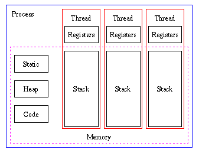

# **쓰레드의 병목현상을 어떻게 제어할까**


---

## 1. cpu

전에도 한번 봤지만 프로세스는 운영체계의 자원을 가져와서(대표적으로 메모리) 그 재료들과 공간 위에서 실행되는 프로그램의 단위다. 예를들어 내가 포토샵을 킨다면, 포토샵은 운영체계한테 "나 실행되고싶은데 자원좀 굽신굽신" 하게되고,운영체계는 이에 대해 허용을 하면 시스템 콜이라고 하는 응용프로그램이 운용되기 위한 도우미 함수들과 데이터를 전달해주는 즉 관리자적인 역할을 한다.

## 여기서 우선 컴퓨터의 운영체계 구조 중 가장 중요한 파트인 CPU와 메모리의 형태를 보자

```js
*cpu*
= cpu는 간단히 말해 계산기다. 컴퓨터에서 연산작업과 관련한 모든 계산을 처리하는 부분이다. 예를들어, 포토샵을 켜고 브러쉬로 캔버스에 긋는 작업을 한다고 치자. 그렇다면 각 좌표에 대해 어떤 색채로 어떤 도트만큼을 넣어서 어떤 음영값으로 넣어져야 하는지 우리가 브러시를 쓰는 그 한순간에 cpu는 연산을 해주고 그것에 대한 결과물을 도출해주고 그 결과물을 화면에 띄우고 있다.

이 cpu의 안에는 크게 2가지의 파트로 나뉘어진다 (control unit, processer)

0. cpu의 control unit은 명령어들이 실행되는 순서를 기록하고 관리하는 부분이다

1. 프로세서 안에는 _레지스터_라고 하는 부분이 있는데, 메모리와 같이 연산에 필요한 데이터들을 저장하는 일종의 변수와 객체가 하는것과 비슷한 행동을 한다. 따라서, 데이터 레지스터라고 하는 변수처럼 산술 논리연산에 필요한 데이터를 저장하는 것과, 주소 레지스터라고 하는 주소연산에 필요한 주소의 일부분을 저장하는 형태가 있고, 누적값을 일시저장하는 누산기, 다음 실행할 카운터를 설정하는 프로그램 카운터, 어느 메모리 주소에 넣어야 하는지를 계산하는 메모리 주소 레지스터 등으로 되어있다

2. 프로세서 안에는 _연산장치_ 라는 부분은 논리연산(and, or과 같은)과 관련된 내용을 넣어두는 부분이다.
```

# 2. 메모리

아까 말했듯 cpu는 자기 안에 있는 프로세서의 레지스터에 계산을 위한 데이터를 일시적으로 저장하는 공간이 있다.
근데 만약 필요한 데이터들을 죄다 cpu안에 넣어두고 나서 한다고 치면 그것은 몹시 비싼 짓이므로,
cpu가 사용해야 하는 데이터들을 기록저장하는 공간을 따로 마련해 두는 것이 합리적이다. 그것이 메모리이며
메모리에는 메인메모리인 _RAM_ 과 보조기억장치인 _HDD/SSD_ 로 구분된다

메인메모리는 당장 실행되야하는(즉 실행중인 프로그램이 필요로 하는 데이터)를 저장하는 공간으로, 이 RAM이 후달리면 그 말인 즉슨 CPU가 가져와서 처리할 내용물도 적게적게 온다는 소리이기에 느려진다. 그리고 메인메모리는 프로그램이 꺼지면 사라지는 in-memory 성격을 갖고있다. 즉, 프로그램이 실행할 동안 필요로되는 데이터를 저장하는 저장고다.

보조기억장치인 하드는 영구적으로 저장되어 있어야 하는 데이터들을 저장하는 장소이다.(당장 실행하지 않더라도, 나중에 언제든 필요하게 될 데이터를 저장하는 공간)

## 이때, 캐시메모리라고 하는 개념이 있는데 이 캐시매모리는 한번 사용된 메인 메모리의 데이터를 일단 일시적으로 저장하고 있다가 만약 동일한 작업이 필요하게 된다면 먼저 찾아봐서 사용하는 말 그대로 캐시의 역할을 한다.

# 3. 프로세스

자 위처럼 운영체계는 cpu, 메모리 그외 기타드등의 자원을 갖고있고, 운영프로그램 즉 프로세스가 실행되어서 굽신굽신을 하게 되면 자신의 자원을 떼줘서 프로세스가 실행되게 만드는 것이다

프로세스 안에는 쓰레드라고 하는 부분이 존재한다. 쓰레드는 간단히 말해 프로세스가 운영체계로부터 받아온 자원들을 가지고 내용을 처리하는데 그 처리의 실행단위라고 보면 된다. 이것은 전에 보라돌이 티셔츠 형님이 보여주셨던, stack과 event 루프를 통해 내용물을 처리하고 있고 외부에서 공유적으로 사용할 데이터인 static과 레퍼런스 주소인 heap 그리고 실행을 위한 코드들로 이루어져 있다. 멀티 쓰레드는 이 쓰레드가 하나가 아닌 여러개로 되어있는 것을 뜻하고, 멀티
프로세스는 운영체계에서 각 프로세스마다 메모리를 빼와서 사용하므로 별로 좋지 않고 멀티 쓰레드를 통해 한 프로세스에서 다양한 처리를 하는 것이 효과적이다


(멀티쓰레드의 모습)

그런데, 이런 쓰레드의 문제는 만약 여러개의 쓰레드가 있을 경우, 서로 같은 공유된 자원을 가지고 이용하다가 데이터가 변경될 경우 다른 스레드에서 그 변조된 공유데이터를 사용시에 문제가 발생할 수 있다는 것이다.(전문적으로 데드락이라고 한다) 이는 다시말해 스레드간에 동기화가 필수적이라는 소리인데, 그것을 위한 기법이 크게 2가지가 있는데 여기선 용어정리만 하려고 한다

1. 뮤텍스
   뮤텍스 방식은 말 그대로 한 스레드가 교착상태(critical section) 과 관련된 내용물을 다루고 있다면 다른 스레드에서 그 교착상태에 대한 내용물을 건드려고 하면 못하게 막는것이다. 이것은 일종의 비동기적인 작업과 매우 흡사하다.

예를들어, 한 스레드가 데이터 a를 사용중인데 다른 스레드가 데이터 a를 사용한 결과물을 도출해야 한다고 할 시에 a의 결과를 기다려주고 나서 그 뒤에 다른 스레드가 와가지고 그 데이터를 사용하게 만드는 것이 합리적이다.
따라서 뮤텍스는 이 교착상태와 관련된 다른 스레드들을 모두 락시켰다가 교착상태를 사용하는 스레드가 끝나면 그제서야 하나씩 풀어주는 일종의 큐와 같은 느낌을 갖고 있다.

2. 세마포어
   세마포어 역시 뮤텍스처럼 다른 스레드가 어떤 행동을 하는 것을 제어하는 것은 비슷하다. 그런데 뮤텍스랑 차이가 있다면 뮤텍스는 완전히 스레드들을 다 대기상태로 만들어버린다면 세마포어는 카운터를 정해놓고 이 카운터의 한계점이 도달하기 전까지는 스레드들의 활동을 보장하는 형태로 되어있다. 이를 구현하는 방식으로 은행원 알고리즘과 같이 총 자원량과 각 스레드들이 요구하는 데이터 양을 미리 파악한 후, 한계점의 데이터까지는 스레드들이 활동할 수 있게 만들어주는 그런 방식도 사용할 수 있다고 한다.
