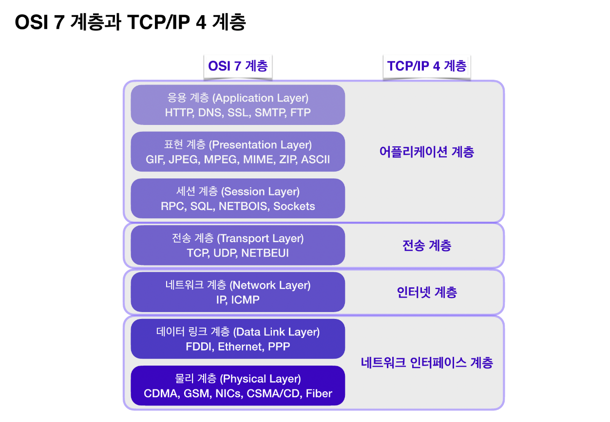

# **IP패킷과 TCP 세그먼트의 차이**

---

# 1. 일전에 http 내용을 공부하며...

IP 패킷의 구성요소에 헤더, 페이로드, 트레일러 라는 존재가 있고 이것을 통해 서버에게 전달을 한다고 했다. 해당 계층은 물리적으로 연결된 네트워크 인터페이스 계층 그 다음에 존재하는 인터넷 계층인데

단순하게 상대 컴퓨터의 주소인 IP를 가지고 전송하던 IP 패킷만으로는 문제점이 있었다.

1. 비연결성 => 해당 응답서버의 ip 대상이 없는데도 불구하고 클라이언트는 모르기에 패킷을 전송하게 될 수 있음
2. 비연속성 => 모든 조각난 패킷들이 모여있을 때 이게 순서가 맞지 않게 도착하여 결합될 수 있음

따라서 이 문제를 해결하기 위해 그 위, 전송계층에서 해당 패킷을 세그먼트로 감싸주는 TCP라는 방법을 이용하여 비연결성과 비연속성을 해결한다.

# 2. TCP의 방식

TCP가 나온 배경은 하나의 물리적인 선만으로 통신을 하다 보면 이 선이 끊어졌을 시에 네트워크가 끊겨버리는 문제점을 해결하고자 하는데에서 나왔다.

즉, 데이터를 여러개의 세그먼트로 쪼갠 후, 그것을 또한 여러개의 네트워크를 통해 분산해서 전달하자. 그렇게 하면 하나가 어느 한군데가 폭격을 맞아서 없어지더라도 다른곳에서 있는 부분은 살아남을 수 있다.

라는 것이다.

또한, TCP 전송에 대한 부족함을 충족하기 위한 방안으로

-a. 중간에서 세그먼트가 유실될 경우 => ARQ(autometic repeat request)를 통해 다시 재전송해달라는 요청을 다른 네트워크를 경유하여 요청

-b. 도착받은 정보를 조립하는 과정에서 순서가 어긋나는 것을 해결하기 위해 => 시퀀스 번호를 같이 달아서 보내준다

-c. 수신측이 송신측의 한계를 넘는 정보를 전달하려고 하는 경우 => 슬라이딩 윈도우를 통해 수신측이 처리할 수 있는 양만큼을 전달한다.

의 방식으로 보완하였다

# 3. TCP의 헤더 구조

tcp의 헤더를 보면 수신측과 송신측의 포트번호를 담긴 장소가 존재한다.
(ip주소는 ip패킷에서 정의되어 있다)

또한 세그먼트의 순서를 파악하기 위한 시퀀스 번호가 존재하고,

그 아래의 승인번호(acknowlegde number)란 데이터를 받은 수신자가 예상하고 있는 다음 시퀀스 번호를 의미한다.

Data offset은 헤더가 아닌 데이터가 시작되는 위치를 표현한다.

그 다음 세그먼트의 속성을 표현하기 위한 플레그들(NS,CWR,URG등등) 이 존재하고 이 내용들은 각각 세그먼트를 수신자측에 전달하는 과정 중에서 발생할 수 있는 상황들에 대한 정의들을 내려서 해당 키워드를 통해 어떤 행동을 해야하는지를 알려주는 역할을 한다
(예를들어, RST는 리셋을 의미하고 이미 연결되어 있는 ESTABLISHED 인상태의 서버연결을 강제리셋해달라는 요청이다)

window 사이즈는 한번에 전송할 수 있는 데이터의 양을 의미한다.

checksum은 데이터를 송신하는 중 발생할 수 있는 오류검출을 위한 값이다.
예를 들어, 2진수로 이루어진 8비트의 값 두개를 합쳐본 값과(1의 보수하는것 포함) 그 값의 반대되는 값을 만들어 더해봤을 때 11111111 와 같이 1만 존재한다면 그 데이터는 정상이고, 아니라면 어딘가 문제가 있다고 판단하는 것이다.

# 4. 3 handShake

데이터 전송을 위한 TCP의 검증을 위해, 우선적으로 하는 행동이 바로 3핸드쉐이크 방식이다
이것은 클라이언트측에서 한번 예시적으로 임시 데이터와 함께 SYN 패킷에다가 자신이 수신할 수 있을만큼의 양에 대한 윈도우 사이즈 정보를 담아서 전달한다. 그러면 서버측이 만약 존재한다면 SYN 패킷에다가 ACK 코드를 담아서 받았던 수신측의 윈도우 크기를 고려하여 데이터를 담아서 전달한다. 그 후 수신측에서 받은 것을 확인했다는 의미로 ACK가 담긴 패킷을 다시 서버에 전달하면, 서버가 그것을 받았을 시에 내부적으로 ESTABLISHED 상태가 되면서 연결이 완성된다.
