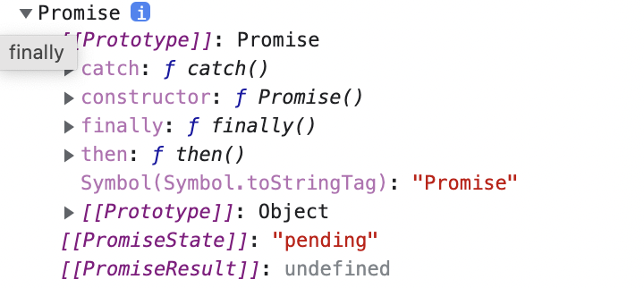

# **그동안 비동기 에러처리에 대해 얼마나 대충 생각했는지를 뼈저리게 느끼는 글**


---

Promise 는 비동기를 다루기 위한 객체이다. 기존 콜백을 통한 비동기 처리와는 다르게, than 체이닝을 통해서 후위에 이루어져야 할 처리들을 미뤄놓는 방식으로 순서를 만들 수 있다.

그리고 근래 업데이트된 async await 덕택에 then 체이닝에서도 벗어나 조금 더 깔끔하게 프로미스를 사용하게 되었다... 라고 이정도까지 알고 있었던 게 오산이었던 것이다.

그러므로, 이번엔 프로미스 처리에 대해서 에러를 중심으로 하는 내용을 정리한다

# 기본적인 에러 핸들링

기본적으로 프로미스 에러를 처리하는 방법은

```js
fetch("https://no-such-server.blabla") // 거부
  .then((response) => response.json())
  .catch((err) => alert(err)); // TypeError: failed to fetch (출력되는 내용은 다를 수 있음)
```

저렇게 잘못된 주소에서 거부되면 catch를 통해 받는다는 것을 기억하고 있다.

여기서 fetch 역시 프로미스 객체이다.

프로미스 객체를 만들기 위해 사용되는 Promise 빌트인 생성자 함수는 암묵적으로 new를 통해 객체를 생성할 때, 인자로 받는 콜백 함수에게 자신의 프로토타입 객체에 존재하고 있던 constructor, 즉 Promise 생성자 자체의 안에 들어있는 정적 메소드 **resove**, **reject**를 전달해 줄 수 있다.



보이는 내용은 new Promise(()=>{}) 를 통해 만들어낸 기본적인 프로미스 객체의 프로토타입 슬롯을 펼쳐본 것이다.

내용에서 볼 수 있듯, 이 프로토타입에는 Promise.prototype 객체에 정의된 내용이 들어있고,
거기에 존재하는 constructor 프로퍼티를 통해 Promise 생성자 자체의 정적 메소드에 접근이 가능하다.

한가지 특이한 점은,

=> _new Promise(()=>{})_ 안으로 들어오게 되는 콜백 함수의 내부에는 암묵적으로 try... catch 구문이 적용되고 있다는 점이다.

그렇기 때문에

```js
new Promise((resolve, reject) => {
  throw new Error("에러메세지");
}).catch(alert);
```

가 가능해진다. 즉, 프로미스 객체를 생성하면서 콜백으로 정적 메소드를 전달함과 동시에, 그 안에 있는 구문을 실행하기 시작한다. 해당 구문 안은 try catch가 적용되고 있고, 안에서 에러객체를 던지도록 설계되어 있으므로 프로미스 객체가 생성되는 순간 내부 내용을 판단하고 에러객체임이 인지되어 catch에 해당 객체를 전달하여 실행할 수 있는 것이다.

즉, promise 객체의 catch는 반드시 존재해야하며, 일단 존재하는 한 그 내부에서 어떠한 과정 가운데에 에러가 발생해도 그 에러를 인지하고 가장 가까운 catch 메소드에 그 객체를 전달할 수 있다.

즉, 에러는 그 자체로 내버려두면 에러가 되어 코드가 다 망가지지만, catch를 통해 이 에러객체를 인식시켜 받을 수 있다면, 그것은 처리할 수 있는 객체가 된다.

```js
new Promise((resolve, reject) => {
  throw new Error("에러 발생!");
})
  .catch(function (error) {
    alert("에러가 잘 처리되었습니다. 정상적으로 실행이 이어집니다.");
  })
  .then(() => alert("다음 핸들러가 실행됩니다."));
```

> 중간에 에러가 생겼다고 체이닝이 끝나는 것이 아닌, catch를 통해 처리한 후 다시 then을 통해 다음작업을 이어나갈 수 있다.

저 내용을 보면 알 수 있듯, catch는 암묵적으로 thenable한, 프로퍼티 then을 가진 프로미스 객체를 또다시 리턴하는 것을 알 수 있다.

또한, 만약 catch 부분에서 다시금 에러를 리턴했을 경우, 중간에 끼여있는 then은 무시되고 가장 가까운 then으로 그 작업 흐름이 이어진다

```js
new Promise((resolve, reject) => {
  throw new Error("에러 발생!");
})
  .catch(function (error) {
    // (*)

    if (error instanceof URIError) {
      // 에러 처리
    } else {
      alert("처리할 수 없는 에러");

      throw error; // 에러 다시 던지기
    }
  })
  .then(function () {
    /* 여기는 실행되지 않습니다. */
  })
  .catch((error) => {
    // (**)
    alert(`알 수 없는 에러가 발생함: ${error}`);
    // 반환값이 없음 => 실행이 계속됨
  });
```

위 내용에서도 볼 수 있듯, catch에서 에러객체를 잡아냈으나, catch에서 해당 에러객체의 인스턴스, 즉 이 에러객체를 만든 생성자 함수의 프로토타입을 확인해보니, URIError 생성자의 프로토타입이었다. 그러면 에러처리를 해서 then으로 넘어갔겠지만, 그 외에는 else를 통해 alert를 실행하고 다시금 throw error로 이 에러객체를 다시 리턴하고 있다.

자 그럼 그 다음에는 catch가 리턴하는 객체의 타입이 에러객체이므로, then이 실행되지 않고, 그 객체는 연결되어 있던 catch에 전달되어 실행된다.

참고로 주의할점은, 이 암묵적인 내부 try... catch는 오로지 **동기적** 인 함수호출간에서만 처리가 가능하다는 것이다.

예를들어, 프라미스 객체에 전송되는 콜백 함수 내부에서 비동기적으로 에러가 처리가 될 경우, 이것은 catch로 잡아내지지 않는다. 즉

```js
new Promise(function (resolve, reject) {
  setTimeout(() => {
    throw new Error("에러 발생!");
  }, 1000);
}).catch(alert);
```

해당 내용은 setTimeout으로 에러객체를 던지는 비동기 함수가 실행되고 있다.

try.. catch가 암묵적으로 존재함에 따라 해당 setTimeout 비동기 함수는 호출이 될 것이고, 이것은 그 안에 있는 콜백을 태스크 큐에 넣으면서 이 함수객체를 평가를 완료할것이다. 그리고 1초가 지나면 그제서야 이벤트루프에 전달되면서 콜스텍이 다 비어지길 기다린 이후에 해당 함수가 실행되어 에러를 실행할것이다.

try... catch는 동기적으로 이루어지는 활동만 감지하므로, 해당 비동기 함수의 호출내역은 에러로 감지할 수가 없다.

만약 해당 내용을 에러로 감지하게 만드려면 async await을 통해 해당 비동기 함수의 호출이 완료되는걸 함수 내에서 기다리도록 프리징하게 만들 수밖에 없다.

## 에러가 처리되지 못할 경우

만약 처리가 되지 못한 에러가 존재하면 어떻게 될까.
즉, 이렇게 비동기적인 체이닝 행동 가운데에 마지막에 까먹고 catch를 안썼을 경우를 말한다. 그렇게 되면 발생하는 과정은 자바크스립트 엔진이 프라미스의 거부를 처리할 캐치가 없음을 확인하고 전역 에러를 생성한다

이것은 window객체에 eventLisner 자료구조에 unhandleedrejection이라는 키워드로 등록이 되며, 해당 함수가 실행되게 된다.

그렇다면 이것을 콜스텍과, 태스크큐, 이벤트 루프의 관점에서는 어떻게 해석이 될까?

자바스크립트 엔진은 일단 비동기 함수가 콜스텍에 들어오는 순간, 이것을 비동기적인 함수임을 인지하고 그것을 태스크 큐에 넣는다. 그리고나서, 뒤에 연결고리가 되어있는 then,catch,finally와 같은 체이닝된 메소드들의 호출을 인식한다.

그러면 얘들이 어디로 들어갈까?

자바스크립트 v8 엔진에 의하면 이 해당 메소드들의 처리는 마이크로태스크 큐라고 하는 또다른 큐에 저장된다고 한다.

그리고 나서 콜스텍이 비워져서 이벤트 루프에 들어간 비동기 함수가 호출이 완료되면, 그 이후에 마이크로테스크 큐에 저장되어 있는 체이닝된 메소드 함수객체들을 이벤트 루프에 넣으면서 들어오는 순으로 하나씩 처리를 하기 시작한다.

즉 다시말해, 자바스크립트 엔진은 이렇게 마이크로테스크 큐에 있는 내용을 확인하여 중간에 에러가 발생을 했는데 큐를 끝가지 돌아도 catch 메소드가 보이지 않는다? 그러면 윈도우 객체에 이벤트 리스너

"unhandledrection" 이라는 키로 함수를 등록하고 그것을 트리거한다.

그럼 만약에 catch를 나중에 등록해주면 어떻게 될까

예를들어

```js
let promise = Promise.reject(new Error("실패!"));
setTimeout(() => promise.catch((err) => alert("에러!")), 1000);
```

저런 상황일 경우를 분석해보자

일단 자바스크립트 엔진은 프로미스 객체의 reject를 "실패!"라는 에러 메세지를 가진 에러객체를 주입하여 호출하려고 한다.

근데 이것은 마이크로테스크 큐에 들어가야 할 목록이므로, 새로운 스레드에서 분류가 될것이다.
그 후, 비동기 함수인 setTimeOut을 호출한다.
해당 함수는 태스크 큐에 들어가 분류되고 평가된 상태로 대기를 하는 상태다.

그러면 이제 콜스텍이 비워졌으니, 비동기 영역이 등장할 차례다. 순서상 마이크로테스크 큐에 있는 reject가 먼저 호출되었으므로 해당 메소드가 실행된다. 그러면 에러객체가 리턴되고 있으므로 자바스크립트 엔진은 해당 에러를 처리할 catch가 마이크로 테스크 뮤 안에 존재하는지를 확인한다.

없는 것을 확인한 엔진은 그대로 윈도우 객체에 unhandledrejection을 내보내며 에러 메세지를 보여준다.

그리고 그 후, 태스크 큐에 등록되어 있던 이벤트 리스너의 콜백이 이벤트 루프에 등록되어 실행되면서, catch가 호출된다. 그러면 이것은 다시 마이크로테스크큐에 들어갈것이고, 콜스텍은 비워져 있으므로 끄집어내져서 호출된다.

이 때, 호출로 사용되고 있는 객체는 promise 객체, 즉 이미 위에서 reject로 에러를 처리하여 에러객체를 슬롯에 등록하고 있는 객체이다. 그러므로 이 메소드가 호출되면 콜백 인자에 기존 에러내용이 저장된 에러객체가 할당되고, 함수 몸체가 실행되게 되어 "에러!" 가 튀어나오게 된다.
